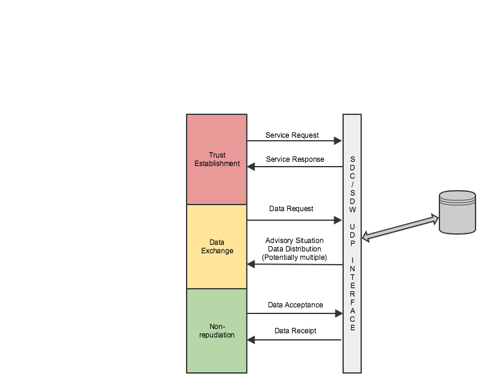

# UDP Interface

The SDC/SDW stores and distributes Traveler Information Messages (TIMs). The UDP Interface of the mvp SDC/SDW allows users to programmatically receive these TIMS bundled as Advisory Situation Data Distributions. To receive data from this interface, a specific UDP dialog sequence must be followed. The below diagram depicts this sequence. 



**Each of these messages are UPER encoded.


### Prerequisites
* JDK 1.8: http://www.oracle.com/technetwork/pt/java/javase/downloads/jdk8-downloads-2133151.html
* Maven: https://maven.apache.org/install.html
* Git: https://git-scm.com/


### Getting Started

#### Step 1 - Clone this repository
```
git clone https://github.com/usdot-jpo-sdcsdw/udp-interface.git
```
#### Step 2 - Clone and install dependencies
Follow instructions for cloning and installing the common-models and per-xer-codec repositories

#### Step 2 - Build the application
```
cd udp-interface
mvn clean install
```

#### Step 3 - Set Up & Running the Application
Copy the UDPInterface-1.0.0-SNAPSHOT-jar-with-dependencies to a desired directory. In this example we will use "runDir"
```
mkdir runDir
cp /target/UDPInterface-1.0.0-SNAPSHOT-jar-with-dependencies.jar ./runDir/
```
Copy the native library generated by the building the per-xer-codec to runDir. 
```
cp libper-xer-codec.so ./runDir/ 
```
Create config/settings.properties. Sample [settings.properties](src/main/resources/config/settings.properties)
```
cd runDir
mkdir config
nano config/settings.properties
```

Run the application
```
java -Djava.library.path=. -jar UDPInterface-1.0.0-SNAPSHOT-jar-with-dependencies.jar
```


## Built With

* [Maven](https://maven.apache.org/) - Dependency Management


## License

This project is licensed under the Apache License - see  [LICENSE](LICENSE) file for details


